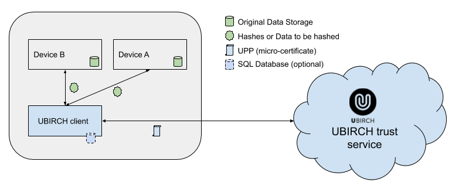

# UBIRCH client (go)

The UBIRCH client provides signature and chaining services to seal original data generated on-premise. It takes care of
packaging the hashed data into a chained *UBIRCH PROTOCOL PACKET ("UPP")*, signing the package and sending it to the
UBIRCH backend for storage, anchoring in the blockchain, and as a source for verification requests.

*The original data must be stored in a customer database to be able to execute verification requests at a later stage.
UBIRCH does not store any original sensitive data!*

UPP data is sent to the UBIRCH client via HTTP requests. The client can receive either the original data as a JSON data
package which will be formatted and hashed (SHA256) by the client, or the binary representation of a SHA256 hash that is
directly added as payload to the UPP.

The UBIRCH client stores its signing keys and the signature of the last UPP persistently to ensure an intact chain after
a restart.



---
**WARNING**

By default, the client stores the encrypted signing keys in a local file `keys.json`, which will be created in the
working directory upon start-up. **Do not delete this file**, as our backend will not accept new key registrations once
a device already has a registered key.

Further, the client creates a subdirectory `/signatures` with multiple binary files, which contain the previous UPP
signatures for chaining.

---

## Dockerized UBIRCH client

The UBIRCH client is provided as a multi-architecture docker image that can be configured and run on any system that can
run docker (Intel/AMD64 or ARM64 architecture).

Docker Hub Address: [ubirch/ubirch-client](https://hub.docker.com/r/ubirch/ubirch-client)
> See how to [run client in Docker container](#run-client-in-docker-container)

[Jump to Quick Start](#quick-start)

### Requirements

- System based on Intel/AMD64 or ARM
- Docker installation
- Space to store last used signatures and key material, either:
    - disk space, mounted into the docker pod, or
    - as SQL database
- Possibility to send a HTTP request to UBIRCH.com domains
- A unique identifier (UUID) registered with the UBIRCH console
- A corresponding authentication token (acquired via UBIRCH console)
- A password for the client’s key store
- (OPTIONAL) a private ECDSA (ecdsa-prime256v1) key
  *(otherwise a new key is generated by the client itself)*

## Building

There are multiple make targets, to simplify the building process.

```shell
make           # default target: build
make all       # create all available artifacts
make build     # create all supported binaries
make pack      # compresses the binaries to be much smaller (requires UPX installation)
make image     # create docker image
make publish   # builds images for amd64 armv7 and arm64, publishes under versioned tag
               # takes IMAGE_TAG= to specify a different tag name
make clean     # delete all artifacts
```

Compiled artifacts will be saved to the `build/` directory.

```shell
make publish IMAGE_TAG=stable # will tag a multi-arch image with the selected tag and upload it
                              # to the dockerhub.
```

## Configuration

The client may be configured using a configuration file (`config.json`) or by using environment variables that can be
passed to the docker executable.

The client is able to handle multiple cryptographic identities (i.e. for multiple LAN based devices). The UUIDs for
these devices must be declared in the configuration file together with their respective authentication token. Only
requests from *known* UUIDs will be accepted by the client.

The client will first look if the `UBIRCH_SECRET` env variable exists and load the configuration from the environment
variables in that case. If the `UBIRCH_SECRET` env variable is not set or empty, and the `config.json`-file exists in
the working directory, the configuration will be loaded from the file. If neither exist, the client will abort and exit.

The only mandatory configurations are

1. the `devices`-map, which maps device UUIDs to their authentication token

> - A UUID can be generated in a Linux/macOS terminal with the `uuidgen` command
> - See [here](#how-to-acquire-the-ubirch-backend-token) how to acquire the authentication token

2. the 16 byte base64 encoded `secret`, which is used to encrypt the key store

> Quickly generate a random 16 byte base64 encoded secret in a Linux/macOS terminal with `head -c 16 /dev/urandom | base64`

### File Based Configuration

`config.json`:

```json
{
  "devices": {
    "<UUID>": "<ubirch backend auth token>"
  },
  "secret": "<16 byte secret used to encrypt the key store (base64 encoded)>"
}
```

> See [example_config.json](main/config/example_config.json) as an example for file-based configuration.

Beside the `devices`-map, the device UUIDs and their corresponding authentication tokens can also be set through a file
"`identities.json`". See example: [example_identities.json](main/config/example_identities.json)

### Environment Based Configuration

```shell
UBIRCH_DEVICES=<UUID>:<ubirch backend auth token>
UBIRCH_SECRET=<16 byte secret used to encrypt the key store (base64 encoded)>
```

> See [example.env](main/config/example.env) as an example for environment-based configuration.

All further configuration parameters have default values, that can be changed as described
under [Optional Configurations](#optional-configurations).

### How to acquire the ubirch backend token

- Create an account at the [**UBIRCH web UI**](https://console.prod.ubirch.com/) and log in
- Go to **Things** (in the menu on the left) and click on `+ ADD NEW DEVICE`
- Enter your UUID to the **ID** field. You can also add a description if you want. Then click on `register`.
- Your UUID should now show up under the **Your Things**-overview. Click on it and copy the "password" (which looks like
  a UUID) from the `apiConfig`. This is the UBIRCH backend token needed for the configuration of the client.

[Jump back to Configuration](#configuration)

## Run Client in Docker container

To get the latest multi-architecture image, check
the [releases](https://github.com/ubirch/ubirch-client-go/releases/latest)
and pull the latest release from Docker Hub using the release tag, e.g.:

```console
docker pull ubirch/ubirch-client:v1.1.7
```

To start the multi-arch Docker image on any system, run:

```console
docker run -v $(pwd):/data -p <host_port>:8080 ubirch/ubirch-client:v1.1.7
```

> replace `<host_port>` with the desired TCP network port on the host (e.g. `-p 8080:8080`)

The default configuration directory inside the docker container is `/data`. The docker image mounts the current
directory (`$(pwd)`) into the */data* path to load the configuration file (if configuration is not set via environment
variables), and the TLS certificate and key files (if TLS is enabled). If no DSN (database) is set in the configuration,
the image stores the protocol context
(i.e. keystore and last signatures) in this directory as well, in which case the directory must be writable.

It is also possible to pass an absolute path instead of `$(pwd)`.

If the */data* path is not used for either configuration file, TLS cert files, or to store the protocol context,
the `-v $(pwd):/data` parameter can be omitted.

## Interface Description

The UBIRCH client provides HTTP endpoints for both original data and direct hash injection, i.e. the SHA256 digest of
the original data. If the client receives original data, it will create a SHA256 hash before any further processing.

*We don't care about your data!*

This means that the original data will have to be stored independently in order to be able to verify it later.

> When receiving a JSON data package, the UBIRCH client will sort the keys alphabetically and remove insignificant
> space characters before hashing.
>
> See [reproducibility of hashes](#reproducibility-of-hashes).

### UPP Signing Service

Signing service endpoints require an authentication token, which corresponds to the `UUID` used in the request. The
token must be sent with the request header. Without it, the client will not accept the request.

| Request Header | Description |
|----------------|------------------------------------------|
| `X-Auth-Token` | UBIRCH backend token related to `<UUID>` |

> See [how to acquire the ubirch backend token](#how-to-acquire-the-ubirch-backend-token).

#### Anchoring Hashes (chained)

| Method | Path | Content-Type | Description |
|--------|------|--------------|-------------|
| POST | `/<UUID>` | `application/octet-stream` | original data (binary) will be hashed, chained, signed, and anchored |
| POST | `/<UUID>` | `application/json` | original data (JSON data package) will be hashed, chained, signed, and anchored |
| POST | `/<UUID>/hash` | `application/octet-stream` | SHA256 hash (binary) will be chained, signed, and anchored |
| POST | `/<UUID>/hash` | `text/plain` | SHA256 hash (base64 string repr.) will be chained, signed, and anchored  |

#### Anchoring Hashes (no chain)

| Method | Path | Content-Type | Description |
|--------|------|--------------|-------------|
| POST | `/<UUID>/anchor` | `application/octet-stream` | original data (binary) will be hashed signed, and anchored |
| POST | `/<UUID>/anchor` | `application/json` | original data (JSON data package) will be hashed signed, and anchored |
| POST | `/<UUID>/anchor/hash` | `application/octet-stream` | SHA256 hash (binary) will be signed, and anchored |
| POST | `/<UUID>/anchor/hash` | `text/plain` | SHA256 hash (base64 string repr.) will be signed, and anchored |

#### Update Operations

Beside anchoring, the client can request hash update operations from the UBIRCH backend, i.e. `disable`, `enable`
and `delete`.

| Update Operation | Path (original data)| Path (hash) |
|------------------|---------------------|-------------|
| disable | `/<UUID>/disable` | `/<UUID>/disable/hash` |
| enable  | `/<UUID>/enable`  | `/<UUID>/enable/hash`  |
| delete  | `/<UUID>/delete`  | `/<UUID>/delete/hash`  |

Hash update requests to the UBIRCH backend must come from the same UUID that anchored said hash and be signed by the
same private key that signed the anchoring request.

#### UPP Signing Response

Response codes indicate the successful delivery of the UPP to the UBIRCH backend. Any code other than `200` should be
considered a failure. The client does not retry itself. A good approach to handle errors is to add a flag to the
original data storage that indicates whether the UBIRCH blockchain anchoring was successful and retry at a later point
if necessary.

The response body consists of either an error message, or a JSON map with

- the data hash,
- the UPP, which contains that data hash and was sent to the UBIRCH backend by the client,
- the response from the UBIRCH backend,
- the unique request ID
- *possibly:* a description of an occurred error (**the `error`-key is only present in case an error occurred**)

```fundamental
{
  "hash": "<base64 encoded data hash>",
  "upp": "<base64 encoded UPP containing the data hash>",
  "response": {
    "statusCode": <backend response status code (int)>,
    "header": {<backend response header (map[string][]string)>},
    "content": "<base64 encoded backend response content>"
  },
  "requestID": "<request ID (standard hex string representation)>",
  "error": "error message"
}
```

> UPPs (such as the backend response content) are [MessagePack](https://github.com/msgpack/msgpack/blob/master/spec.md) formatted
> and can be decoded using an online tool like [this MessagePack to JSON Converter](https://toolslick.com/conversion/data/messagepack-to-json).

#### Error Codes

| HTTP response status code | orig. data | hash | description |
|---------------------------|---------------------|---------------|-------------|
| 200 - OK | x | x | success |
| 400 - Bad Request | x | x | unable to read request body |
|                   | x |   | invalid content-type for original data (≠ `application/octet-stream` or `application/json`) |
|                   | x |   | unable to parse JSON request body (*only for content-type `application/json`*) |
|                   |   | x | invalid content-type for hash (≠ `application/octet-stream` or `text/plain`) |
|                   |   | x | decoding hash failed (*only for content-type `text/plain`*) |
|                   |   | x | invalid SHA256 hash size (≠ 32 bytes) |
| 401 - Unauthorized | x | x | unknown UUID |
|                    | x | x | invalid auth token |
| 404 - Not Found | x | x | invalid UUID  |
|                 | x | x | invalid operation (≠ `anchor` / `disable` / `enable` / `delete`) |
| 500 - Internal Server Error | x | x | signing failed |
|                             | x | x | sending request to server failed |
| 503 - Service Temporarily Unavailable | x | x | service busy |
| 504 - Gateway Timeout | x | x | service was unable to produce a timely response |

Internally, the client sends a request to the UBIRCH authentication service (*Niomon*) and forwards its response back to
the sender (i.e. the `"response"`-filed in the JSON response body of the client). If no other errors occurred, the
client will adopt the HTTP response status code of the backend response.

> See
the [swagger documentation](https://developer.ubirch.com/api.html?url=https://niomon.demo.ubirch.com/swagger/swagger.json#/Ubirch%20Protocol%20Packet/Receives%20Ubirch%20Protocol%20Packets)
for *Niomon* error codes.

#### CURL Request Examples:

1. original data (JSON):

    - anchor hash (**chained**)
        ```console
        curl localhost:8080/ba70ad8b-a564-4e58-9a3b-224ac0f0153f \
          -H "X-Auth-Token: 32e325d5-b6a9-4800-b750-49c53b9350fc" \
          -H "Content-Type: application/json" \
          -d '{"id": "ba70ad8b-a564-4e58-9a3b-224ac0f0153f", "ts": 1585838578, "data": "1234567890"}' \
          -i
      ```
    - anchor hash (**unchained**)
        ```console
        curl localhost:8080/ba70ad8b-a564-4e58-9a3b-224ac0f0153f/anchor \
          -H "X-Auth-Token: 32e325d5-b6a9-4800-b750-49c53b9350fc" \
          -H "Content-Type: application/json" \
          -d '{"id": "ba70ad8b-a564-4e58-9a3b-224ac0f0153f", "ts": 1585838578, "data": "1234567890"}' \
          -i
      ```
    - disable hash
        ```console
        curl localhost:8080/ba70ad8b-a564-4e58-9a3b-224ac0f0153f/disable \
          -H "X-Auth-Token: 32e325d5-b6a9-4800-b750-49c53b9350fc" \
          -H "Content-Type: application/json" \
          -d '{"id": "ba70ad8b-a564-4e58-9a3b-224ac0f0153f", "ts": 1585838578, "data": "1234567890"}' \
          -i
      ```
    - enable hash
        ```console
        curl localhost:8080/ba70ad8b-a564-4e58-9a3b-224ac0f0153f/enable \
          -H "X-Auth-Token: 32e325d5-b6a9-4800-b750-49c53b9350fc" \
          -H "Content-Type: application/json" \
          -d '{"id": "ba70ad8b-a564-4e58-9a3b-224ac0f0153f", "ts": 1585838578, "data": "1234567890"}' \
          -i
      ```
    - delete hash
        ```console
        curl localhost:8080/ba70ad8b-a564-4e58-9a3b-224ac0f0153f/delete \
          -H "X-Auth-Token: 32e325d5-b6a9-4800-b750-49c53b9350fc" \
          -H "Content-Type: application/json" \
          -d '{"id": "ba70ad8b-a564-4e58-9a3b-224ac0f0153f", "ts": 1585838578, "data": "1234567890"}' \
          -i
      ```

1. direct data hash injection

    - anchor hash (**chained**)
        ```console
        curl localhost:8080/ba70ad8b-a564-4e58-9a3b-224ac0f0153f/hash \
          -H "X-Auth-Token: 32e325d5-b6a9-4800-b750-49c53b9350fc" \
          -H "Content-Type: text/plain" \
          -d "wp1WK/3z5yHiGBYUZReiMN4UVM2lUJzAtGg9kFtdy3A=" \
          -i
      ```
    - anchor hash (**unchained**)
        ```console
        curl localhost:8080/ba70ad8b-a564-4e58-9a3b-224ac0f0153f/anchor/hash \
          -H "X-Auth-Token: 32e325d5-b6a9-4800-b750-49c53b9350fc" \
          -H "Content-Type: text/plain" \
          -d "wp1WK/3z5yHiGBYUZReiMN4UVM2lUJzAtGg9kFtdy3A=" \
          -i
      ```
    - disable hash
        ```console
        curl localhost:8080/ba70ad8b-a564-4e58-9a3b-224ac0f0153f/disable/hash \
          -H "X-Auth-Token: 32e325d5-b6a9-4800-b750-49c53b9350fc" \
          -H "Content-Type: text/plain" \
          -d "wp1WK/3z5yHiGBYUZReiMN4UVM2lUJzAtGg9kFtdy3A=" \
          -i
      ```
    - enable hash
        ```console
        curl localhost:8080/ba70ad8b-a564-4e58-9a3b-224ac0f0153f/enable/hash \
          -H "X-Auth-Token: 32e325d5-b6a9-4800-b750-49c53b9350fc" \
          -H "Content-Type: text/plain" \
          -d "wp1WK/3z5yHiGBYUZReiMN4UVM2lUJzAtGg9kFtdy3A=" \
          -i
      ```
    - delete hash
        ```console
        curl localhost:8080/ba70ad8b-a564-4e58-9a3b-224ac0f0153f/delete/hash \
          -H "X-Auth-Token: 32e325d5-b6a9-4800-b750-49c53b9350fc" \
          -H "Content-Type: text/plain" \
          -d "wp1WK/3z5yHiGBYUZReiMN4UVM2lUJzAtGg9kFtdy3A=" \
          -i
      ```

### UPP Verification Service

Verification service endpoints do not require an authentication token.

| Method | Path | Content-Type | Description |
|--------|------|--------------|-------------|
| POST | `/verify` | `application/octet-stream` | verify hash of original data (binary) |
| POST | `/verify` | `application/json` | verify hash of original data (JSON data package) |
| POST | `/verify/hash` | `application/octet-stream` | verify hash (binary) |
| POST | `/verify/hash` | `text/plain` | verify hash (base64 string repr.) |

#### UPP Verification Response

A `200` response code indicates the successful verification of the data in the UBIRCH backend as well as a local
verification of the validity of the retrieved UPP.

The response body consists of either an error message, or a JSON map with

- the requested data hash,
- the UPP, which contains the requested data hash and was retrieved from the UBIRCH backend by the client,
- the UUID of the device from which the data originated,
- the public key of that device, which was used to verify the signature of the retrieved UPP
- *possibly:* a description of an occurred error (**the `error`-key is only present in case an error occurred**)

```json
{
  "hash": "<base64 encoded requested data hash>",
  "upp": "<base64 encoded UPP containing the requested data hash",
  "uuid": "<standard hex string representation of the device UUID>",
  "pubKey": "<base64 encoded public key used for signature verification>",
  "error": "error message"
}
```

### COSE Service

*see specification: [CBOR Object Signing and Encryption (COSE)](https://tools.ietf.org/html/rfc8152)*

The COSE service expects either original data as JSON or CBOR object, or the SHA256 hash of a
[CBOR encoded signature structure](https://tools.ietf.org/html/rfc8152#section-4.4) (`Sig_structure`)
for a [COSE Single Signer Data Object](https://tools.ietf.org/html/rfc8152#section-4.2) (`COSE_Sign1`).

When receiving a JSON data package, the service will encode it
with [Canonical CBOR](https://tools.ietf.org/html/rfc7049#section-3.9) rules.

| Method | Path | Content-Type | Description |
|--------|------|--------------|-------------|
| POST | `/<UUID>/anchor` | `"application/json"` | original data (JSON data package) |
| POST | `/<UUID>/anchor` | `"application/cbor"` | original data (CBOR encoded) |
| POST | `/<UUID>/cbor/hash` | `application/octet-stream` | [SHA256 hash (binary)](#how-to-create-valid-cose-objects-without-sending-original-data-to-the-service) |
| POST | `/<UUID>/cbor/hash` | `text/plain` | [SHA256 hash (base64 string repr.)](#how-to-create-valid-cose-objects-without-sending-original-data-to-the-service) |

To send the **hex** string representation of the hash (instead of base64), the `Content-Transfer-Encoding`-header can be
used.

```json
{"Content-Type": "text/plain", "Content-Transfer-Encoding": "hex"}
```

#### COSE Response

The service returns a ECDSA P-256 signed `COSE_Sign1` object.

```fundamental
    COSE_Sign1 = [
        protected : serialized_map,  # serialized CBOR encoded protected header map (b'\xA1\x01\x26') => {1: -7} => {"alg": <ES256>}
        unprotected : header_map,    # CBOR encoded unprotected header map \xA1\x04\x50\xA7\xEA\x87\xF4\xCF\xC4\x45\x67\x8B\xD1\x0B\x4C\x15\xEA\xF5\x5E => {4: b'\xA7\xEA\x87\xF4\xCF\xC4\x45\x67\x8B\xD1\x0B\x4C\x15\xEA\xF5\x5E'} => {"kid": <UUID>}
        payload : bstr,              # original data or SHA256 hash (depending on request content)
        signature : bstr             # ECDSA P-256 signature of the SHA256 hash of the CBOR encoded COSE_Sign1 signature structure
    ]
```

The returned `COSE_Sign1` object contains the request data (original data or SHA256 hash) as payload and the
following [header parameters](https://tools.ietf.org/html/rfc8152#section-3):

| Bucket | Name | Label | Value | Description |
|--------|------|-------|-------|-------------|
| protected header | "alg" | 1 | -7 ([ES256](https://cose-wg.github.io/cose-spec/#rfc.section.8.1)) | Identifier for the cryptographic algorithm used for signing |
| unprotected header | "kid" | 4 |  <UUID (bytes) corresponding to the key used for signing> | Key identifier |

**Note, that the `COSE_Sign1` object will not be verifiable, if it does not have the original data as payload.**

If only a hash (and not the original data) is sent to the COSE service, the original data must be inserted into the
payload field of the returned `COSE_Sign1` object afterwards, in order to get a valid (verifiable) COSE object.

#### How to create valid COSE objects without sending original data to the service

Here are the steps to create a valid `COSE_Sign1` object with the appropriate hash, which needs to be sent to the COSE
service.

*These steps are only necessary when using the `/hash`-endpoint of the COSE service. When sending original data, this is
done internally by the service.*

1. Create a [Sig_structure](https://tools.ietf.org/html/rfc8152#section-4.4) with the following fields.

    ```fundamental
        Sig_structure = [
            context : "Signature1",           # text string identifying the context of the signature
            body_protected : serialized_map,  # the serialized CBOR encoded protected header map of the `COSE_Sign1` object (b'\xA1\x01\x26') => {1: -7} => {"alg": <ES256>}
            external_aad : bstr,              # empty (b'') or protected application attributes
            payload : bstr                    # serialized CBOR encoded original data (b'<payload>')
        ]
    ```

    - context: `"Signature1"`           (identifier for `COSE_Sign1`)
    - body_protected: `b'\xA1\x01\x26'` (identifier for `ECDSA P-256` signing algorithm)
    - external_aad: `b''`               (*optional:*
      [externally supplied data](https://tools.ietf.org/html/rfc8152#section-4.3) -> not part of the COSE object)
    - payload: *here goes the CBOR encoded original data*

2. Create the value *ToBeSigned* by encoding the `Sig_structure` to a byte string, using the CBOR-encoding described
   in [Section 14](https://cose-wg.github.io/cose-spec/#rfc.section.14).

3. Create the SHA256 hash of the CBOR encoded Sig_structure.

4. Send hash to COSE service.

5. CBOR-decode response into `COSE_Sign1` structure with the following fields.

    ```fundamental
        COSE_Sign1 = [
            protected : bstr,
            unprotected : map,
            payload : bstr,
            signature : bstr
        ]
    ```

6. Insert original data into the `payload` field of the array.

**Pseudo-Code:**

```fundamental
Sig_structure       = ['Signature1', b'\xA1\x01\x26', b'', b'payload bytes']
ToBeSigned          = CBOR_encode(Sig_structure)
SHA256              = SHA256_hash(ToBeSigned)
COSE_Sign1_bytes    = send_to_COSE_service(SHA256)
COSE_Sign1          = CBOR_decode(COSE_Sign1_bytes)
COSE_Sign1->payload = b'payload bytes'
```

### TCP Address

When running the client locally, the default base address is:

```fundamental
http://localhost:8080
```

(or `https://localhost:8080`, if TLS is enabled)

> See [how to set a different TCP address/port for the client](#set-tcp-address).

#### Example:

Here is an example of a request to the client using `CURL`.

- original data (JSON):
  ```console
  curl localhost:8080/<UUID> \
    -H "X-Auth-Token: <AUTH_TOKEN>" \
    -H "Content-Type: application/json" \
    -d '{"id": "605b91b4-49be-4f17-93e7-f1b14384968f", "ts": 1585838578, "data": "1234567890"}' \
    -i
  ```

- direct data hash injection:
  ```console
  curl localhost:8080/<UUID>/hash \
    -H "X-Auth-Token: <AUTH_TOKEN>" \
    -H "Content-Type: text/plain" \
    -d "bTawDQO7nnB+3h55/6VyQ+Tmd1RTV9R0cFcf7CRWzQQ=" \
    -i
  ```

### Uniqueness of hashes

Every anchored data hash, and therefore the data, **must be unique**. The UBIRCH backend will reject the request with
response code `409` if the same hash has been sent previously.

Uniqueness can be achieved by adding a UUID and timestamp to the data before hashing. For example:

```json
{
  "id": "605b91b4-49be-4f17-93e7-f1b14384968f",
  "ts": 1585838578,
  "data": "1234567890"
}
```

### Reproducibility of hashes

It is essential for the hashes to be reproducible in order to use them for verification of the data at a later time.
Since the JSON format is non-deterministic, we need to define rules for converting it to a binary representation before
calculating the hash.

If the client receives a JSON data package, it will generate a *sorted compact rendering* before calculating the hash,
i.e. it will first create a string representation of the JSON formatted data where the keys are in alphabetical order
and insignificant space characters were elided.

#### Example:

- JSON data package:
    ```json
    {
      "id": "605b91b4-49be-4f17-93e7-f1b14384968f",
      "ts": 1585838578,
      "data": {
          "T": "26.250",
          "H": "65"
      }
    }
    ```
- sorted compact rendering (string):
    ```json
    {"data":{"H":"65","T":"26.250"},"id":"605b91b4-49be-4f17-93e7-f1b14384968f","ts":1585838578}
    ```
- SHA256 digest (base64):
    ```fundamental
    uVXpb1vR8UlQnow/FoIcNbvcJ5bY1r2B+DZwe8AYSkE=
    ```

> **Floating-point numbers and integers greater than 2<sup>53</sup> are not allowed as values for the JSON data package!**
>
> If you need to sign floating-point numbers or numbers greater than *9,007,199,254,740,992*, you can pass the string representation, e.g.
> ```json
> {
>   "float": "5.321",
>   "bigNum": "9007199254740993"
> }
> ```

## Optional Configurations

### Set the UBIRCH backend environment

The `env` configuration refers to the UBIRCH backend environment. The default value is `prod`, which is the production
environment. For development, the environment may be set to `demo`, which is a test system that works like the
production environment, but stores data only in a blockchain test net. __However, we suggest using `prod` in general as
`demo` may not always be available__.

> Note that the UUIDs must be registered at the according UBIRCH backend environment,
> i.e. https://console.demo.ubirch.com/.

To switch to the `demo` backend environment

- add the following key-value pair to your `config.json`:
    ```json
      "env": "demo"
    ```
- or set the following environment variable:
    ```shell
    UBIRCH_ENV=demo
    ```

### Use a postgreSQL database to store the protocol context

Instead of a local file, the client can use a postgreSQL database for storing the protocol context
(i.e. the encrypted keystore and last signatures) persistently.

In order to connect to the database, the `DSN` (*Data Source Name*) has to be set in the configuration. If no DSN is not
set, the client will create a file `keys.json` (and `keys.json.bck`) as well as a subdirectory `/signatures` locally in
the working directory.

If you want to use a postgreSQL database,

- add the following key-value pair to your `config.json`:
    ```json
      "postgresDSN": "<data source name for postgres database>"
    ```
- or set the following environment variable:
    ```shell
    POSTGRES_DSN=<data source name for postgres database>
    ```

### Use a SQLite database to store the protocol context

The client also supports context management via SQLite database. The DSN in this case is the path to the SQLite db file.

If you want to use a SQLite database,

- add the following key-value pair to your `config.json`:
    ```json
      "sqliteDSN": "<file path to the .db file>"
    ```
- or set the following environment variable:
    ```shell
    UBIRCH_SQLITE_DSN=<file path to the .db file>
    ```

If no .db file exists in the path provided a new one will get created.

### Customize X.509 Certificate Signing Requests

The client creates X.509 Certificate Signing Requests (*CSRs*) for the public keys of the devices it is managing. The *
Common Name* of the CSR subject is the UUID associated with the public key. The values for the *Organization* and *
Country* of the CSR subject can be set through the configuration.

- add the following key-value pairs to your `config.json`:
    ```json
      "CSR_country": "<CSR Subject Country Name (2 letter code)>",
      "CSR_organization": "<CSR Subject Organization Name (e.g. company)>"
    ```
- or set the following environment variables:
    ```shell
    UBIRCH_CSR_COUNTRY=<CSR Subject Country Name (2 letter code)>
    UBIRCH_CSR_ORGANIZATION=<CSR Subject Organization Name (e.g. company)>
    ```

### Set TCP address

You can specify the TCP address for the server to listen on, in the form `host:port`. If empty, port 8080 is used.

- add the following key-value pair to your `config.json`:
    ```json
      "TCP_addr": ":8080",
    ```
- or set the following environment variable:
    ```shell
    UBIRCH_TCP_ADDR=:8080
    ```

> This describes how to configure the TCP port *the client* exposes,
> **not the docker container**. If you are running the client in a docker container,
> you can configure the exposed TCP port (`<host_port>`) with the according
> argument when starting the client with `docker run`:
>
> `docker run -p <host_port>:8080 ubirch/ubirch-client:vx.x.x`
>
> See [Run Client in Docker container](#run-client-in-docker-container)

### Enable TLS (serve HTTPS)

1. Create a self-signed TLS certificate

   In order to serve HTTPS endpoints, you can run the following command to create a self-signed certificate with
   openssl. With this command it will be valid for ten years.
    ```console
    openssl req -x509 -newkey rsa:4096 -keyout key.pem -nodes -out cert.pem -days 3650
    ```

2. Enable TLS in configuration

    - add the following key-value pair to your `config.json`:
        ```json
          "TLS": true
        ```
    - or set the following environment variable:
        ```shell
        UBIRCH_TLS=true
         ```

3. Set path and filename (optional)

   By default, client will look for the `key.pem` and `cert.pem` files in the working directory
   (same location as the config file), but it is possible to define a different location (relative to the working
   directory) and/or filename by adding them to your configuration file.

    - add the following key-value pairs to your `config.json`:
        ```json
          "TLSCertFile": "<path/to/TLS-cert-filename>",
          "TLSKeyFile": "<path/to/TLS-key-filename>"
        ```
    - or set the following environment variables:
        ```shell
        UBIRCH_TLS_CERTFILE=certs/cert.pem
        UBIRCH_TLS_KEYFILE=certs/key.pem
        ```

### Enable Cross Origin Resource Sharing (CORS)

**Cross Origin Resource Sharing (CORS) can only be enabled if the UBIRCH backend environment is set to `demo`
and will be ignored on production stage.**
> [See how to set the UBIRCH backend environment](#set-the-ubirch-backend-environment)

To enable CORS and configure a list of *allowed origins*, i.e. origins a cross-domain request can be executed from,

- add the following key-value pairs to your `config.json`:
    ```json
      "CORS": true,
      "CORS_origins": ["<allowed origin>"]
    ```
- or set the following environment variables:
    ```shell
    UBIRCH_CORS=true
    UBIRCH_CORS_ORIGINS=<allowed origin>
    ```

An origin may contain a wildcard (`*`) to replace 0 or more characters (e.g.: `http://*.domain.com`). Only one wildcard
can be used per origin.

Setting *allowed origins* is optional. If CORS is enabled, but no *allowed origins* are specified, the default value
is `["*"]`
which means, **all** origins will be allowed.

### Extended Debug Output

To set the logging level to `debug` and so enable extended debug output,

- add the following key-value pair to your `config.json`:
    ```json
      "debug": true
    ```
- or set the following environment variable:
    ```shell
    UBIRCH_DEBUG=true
    ```

### Log Format

By default, the log of the client is in JSON format. To change it to a (more human-eye-friendly) text format,

- add the following key-value pairs to your `config.json`:
    ```json
      "logTextFormat": true
    ```
- or set the following environment variables:
    ```shell
    UBIRCH_LOGTEXTFORMAT=true
    ```

## Quick Start

1. First, you will need a device UUID, an auth token, and a 16 byte secret:
    1. Generate a UUID. On Linux simply enter `uuidgen` in your terminal. Alternatively, you can use an online tool.
    2. Get your auth token from the [UBIRCH web UI](https://console.prod.ubirch.com/):
        - Login or register if you don't have an account yet.
        - Go to **Things** and click on `+ ADD NEW DEVICE`.
        - Enter your UUID to the **ID** field, add a description for your device and click on `register`.
        - Click on your device in the overview and copy the value of the **"password"** from the `apiConfig` as your
          auth token.
    3. To encrypt the locally stored keys, we need a 16 byte secret in base64 format. You can
       enter `head -c 16 /dev/urandom | base64` in a Linux terminal or encode 16 ASCII characters in an online base64
       converter.

1. Create a file `config.json` in your desired working directory with the following content:
    ```json
    {
      "devices": {
        "<YOUR_UUID>": "<YOUR_AUTH_TOKEN>"
      },
      "secret": "<YOUR_16_BYTE_SECRET(base64 encoded)>",
      "logTextFormat": true
    }
    ```
    - Replace `<YOUR_UUID>` with your UUID from step 1.i.
    - Replace `<YOUR_AUTH_TOKEN>` with your auth token from step 1.ii.
    - Replace `<YOUR_16_BYTE_SECRET(base64 encoded)>` with your secret from step 1.iii.
   > Make sure you leave the quotes! [Here](main/config/example_config.json) is an example of how it should look like.

1. To run the dockerized UBIRCH client, you will need to have [Docker](https://docs.docker.com/) installed on your
   computer. Then just enter the following two lines in your working directory:
    ```console
    docker pull ubirch/ubirch-client:v1.1.7
    docker run -v $(pwd):/data -p 8080:8080 ubirch/ubirch-client:v1.1.7
    ```
   You should see a console output like this:
    ```console
    {"level":"info","msg":"UBIRCH client (v2.0.0, build=local)","time":"2021-03-01T18:41:20+01:00"}
    {"level":"info","msg":"loading configuration from file: config.json","time":"2021-03-01T18:41:20+01:00"}
    INFO[2021-03-01 18:41:20.291 +0100] 1 known UUID(s)
    INFO[2021-03-01 18:41:20.291 +0100] UBIRCH backend environment: prod
    INFO[2021-03-01 18:41:20.291 +0100] protocol context will be stored in local file system
    INFO[2021-03-01 18:41:20.291 +0100] generating new key pair for UUID 50b1a5bb-83cd-4251-b674-b3c71a058fc3
    INFO[2021-03-01 18:41:20.664 +0100] 50b1a5bb-83cd-4251-b674-b3c71a058fc3: registering public key at key service: https://key.prod.ubirch.com/api/keyService/v1/pubkey
    INFO[2021-03-01 18:41:21.755 +0100] 50b1a5bb-83cd-4251-b674-b3c71a058fc3: submitting CSR to identity service: https://identity.prod.ubirch.com/api/certs/v1/csr/register
    INFO[2021-03-01 18:41:22.130 +0100] starting HTTP service
    ```
   That means the client is running and ready!

1. The client is now listening for HTTP POST requests on port `8080`. You can either...
    - send JSON data to the `/<UUID>`-endpoint with `Content-Type: application/json`-header, or
    - send hashes to the `/<UUID>/hash`-endpoint with `Content-Type: application/octet-stream`-header.

   Also, set the `X-Auth-Token`-header with your ubirch backend auth token.

   Since the data hash for every UPP must be unique, ensure that the body of each request has a unique content. You can
   do that, for example, by adding an ID and a timestamp to the JSON data package.

   **Floating-point numbers and integers greater than 2<sup>53</sup> are not allowed as values for the JSON data
   package!**

   Here is an example of how a request to the client would look like using `CURL`:
   ```console
   curl -H "X-Auth-Token: <YOUR_AUTH_TOKEN>" -H "Content-Type: application/json" -d '{"id": "50b1a5bb-83cd-4251-b674-b3c71a058fc3", "ts": 1614621028, "data": "1234567890"}' localhost:8080/<YOUR_UUID> -i -s
   ```
   > Insert `<YOUR_AUTH_TOKEN>` and `<YOUR_UUID>` and a request body with your own unique content to ensure a unique hash!

   When the client receives the request, the output should look like this:
    ```console
    INFO[2021-03-01 18:52:59.471 +0100] 50b1a5bb-83cd-4251-b674-b3c71a058fc3: anchoring hash: CDUvtOIBnnZ8im/UXQn5G/q5EK9l2Bqy+HyMgSzPZoA=
    INFO[2021-03-01 18:53:00.313 +0100] 50b1a5bb-83cd-4251-b674-b3c71a058fc3: request ID: 0f11686e-aee3-4e97-8d0d-793a0c31d969
    ```
   > Take note of the hash!

   If your request was submitted, you'll get a `200` response code.

   The HTTP response body from the client is a JSON map containing the data hash, the UPP, which was sent to the UBIRCH
   backend, and the backend response, of which the content is also a UPP, UPPs are in *MessagePack* format
   (base64 encoded) and can be decoded using, for example, this
   [MessagePack to JSON Converter](https://toolslick.com/conversion/data/messagepack-to-json).

   ```json
    {
        "hash": "CDUvtOIBnnZ8im/UXQn5G/q5EK9l2Bqy+HyMgSzPZoA=",
        "upp": "liPEEFCxpbuDzUJRtnSzxxoFj8PEQAAAAAAAAAAAAAAAAAAAAAAAAAAAAAAAAAAAAAAAAAAAAAAAAAAAAAAAAAAAAAAAAAAAAAAAAAAAAAAAAAAAAAAAxCAINS+04gGednyKb9RdCfkb+rkQr2XYGrL4fIyBLM9mgMRAIVlhgxobRl7ApJerXUyJ5cBxBJJ7gwPUN9AKgKJWxAxkWMWufRp8jW9Ha79s5hYbNp9+bn94cMflWyAyyjy4Ew==",
        "response": {
            "statusCode": 200,
            "header": {
                "Content-Length": [
                    "187"
                ],
                "Content-Type": [
                    "application/octet-stream"
                ],
                "Date": [
                    "Mon, 01 Mar 2021 17:53:00 GMT"
                ],
                "Server": [
                    "ubirch-trust-service/1.0"
                ]
            },
            "content": "liPEEJ08eP8i80RBpdGFxjbUhv/EQCFZYYMaG0ZewKSXq11MieXAcQSSe4MD1DfQCoCiVsQMZFjFrn0afI1vR2u/bOYWGzaffm5/eHDH5VsgMso8uBMAxCAPEWhuruNOl40NeToMMdlpAAAAAAAAAAAAAAAAAAAAAMRA+IFgAugN6CY1xPSch1TwhFdac8yRA1QhPRXOhUt7rudrwrNv0NAEJGlLw1wUSpcSLmBFQaoRb9EezmYxmtF7iA=="
        },
        "requestID": "0f11686e-aee3-4e97-8d0d-793a0c31d969"
    }
   ```
   If you get a response code other than `200`, it means that something went wrong. In this case the client will respond
   with an error message. You can also find error messages in the console output of the client.

1. To stop the client, press `ctrl` + `c`.

## Verification

You should now be able to see that your UPP was received and verified by the UBIRCH backend under
[Your Things](https://console.prod.ubirch.com/devices/list) in the UBIRCH web UI.

To look at the anchoring of your data hash in public blockchains, go to the
[UBIRCH web UI verification page](https://console.prod.ubirch.com/verification/graph)
and enter your data hash in the search field.

It is also possible to verify the hash using the API by sending a POST request with the hash you wish to verify to the
UBIRCH verification service:

```fundamental
https://verify.prod.ubirch.com/api/upp/verify/anchor
```

> e.g. `curl -d '<YOUR_HASH>' https://verify.prod.ubirch.com/api/upp/verify/anchor`

This endpoint checks if the *UPP*, which contains the data hash has arrived correctly and was verifiable, gives
information about the chain (*prev*ious UPP) as well as blockchain info on the time frame (the upper and lower bounds)
when the data was received, i.e. the closest blockchain transactions before and after the data was received by the
UBIRCH backend (*anchors*).

If the verification was successful, the service will send a *200* response with a JSON formatted body like this:

```json
{
  "upp": "liPEEJnqh/TPxEVni9ELTBXq9V7EQGOMAcwCV4rbHGZT+A8sd2DOpRB2mdUyZSSg7wB5hYNix5CszzbhRksmDTP/mADH1EBEPnUgfXbo6Y6dbFBL6CgAxCAy+oS7kDq+fc74gcKSX1UsG0iuOx5iwkW/MyED7Df9PcRAQ9hNm3gkM5vyeIX8zwI+7D/VbsgpLV5o4oYLFo7FilA8Urj5ELQNrC0PKYKco0LoC7xNbVoIhrvOnLNZVyme3w==",
  "prev": "liPEEJnqh/TPxEVni9ELTBXq9V7EQFMVGwqOGvuiYahX5+1E9Le/Jse778baMOWX4kPCuvTQnwzCoFOvHY09aor7Wl0Hn7h2mPg7kdJ6N2ZRGKNtXB0AxCCPcQmVZAl1b++fj5h0r17cb1+zPJS3WnjqYt+JsmrZoMRAY4wBzAJXitscZlP4Dyx3YM6lEHaZ1TJlJKDvAHmFg2LHkKzPNuFGSyYNM/+YAMfUQEQ+dSB9dujpjp1sUEvoKA==",
  "anchors": [
    {
      "label": "PUBLIC_CHAIN",
      "properties": {
        "timestamp": "2020-04-16T22:09:17.836Z",
        "hash": "CAGRDRTQBNNHHQONUHBMWPHMUTMCYJ9XNKJJNTHMBUZXYKEUKTERIFMNNFBKWUAMAMXERJBQQFNQWA999",
        "public_chain": "IOTA_TESTNET_IOTA_TESTNET_NETWORK",
        "prev_hash": "ca6d36581d1265d38d7cb69a6a410aefb5142cbd31c3004cb7bbe6ec83457d9c683eb0a2e498083699e9e6dc233356be0df6f9fb2e1810d65e71b1bd155b3580",
        "type": "PUBLIC_CHAIN"
      }
    },
    {
      "label": "PUBLIC_CHAIN",
      "properties": {
        "timestamp": "2020-04-16T22:09:25.614Z",
        "hash": "0x229d8e167a45efe8a552fff884ca2ca540d331dbd51a427107d8ac12f184dc25",
        "public_chain": "ETHEREUM_TESTNET_RINKEBY_TESTNET_NETWORK",
        "prev_hash": "ca6d36581d1265d38d7cb69a6a410aefb5142cbd31c3004cb7bbe6ec83457d9c683eb0a2e498083699e9e6dc233356be0df6f9fb2e1810d65e71b1bd155b3580",
        "type": "PUBLIC_CHAIN"
      }
    }
  ]
}
```

> Note that the first UPP to be anchored will not have a 'previous' package to be chained to. The `"prev"` value will therefore be `null`.

It can take up to **10 minutes** before the anchoring in public blockchains can be verified, but there is also an
endpoint for a quick check, that verifies that the hash was received by the UBIRCH backend:

```fundamental
https://verify.prod.ubirch.com/api/upp
```

... and another endpoint, which additionally checks the chain:

```fundamental
https://verify.prod.ubirch.com/api/upp/verify
```

A *404* response with an empty body means the hash could not be verified (yet).


> You can find more information on the services and functionalities of the UBIRCH backend in [the developer documentation](https://developer.ubirch.com/).

## Copyright

```fundamental
Copyright (c) 2019-2020 ubirch GmbH

Licensed under the Apache License, Version 2.0 (the "License");
you may not use this file except in compliance with the License.
You may obtain a copy of the License at

    http://www.apache.org/licenses/LICENSE-2.0

Unless required by applicable law or agreed to in writing, software
distributed under the License is distributed on an "AS IS" BASIS,
WITHOUT WARRANTIES OR CONDITIONS OF ANY KIND, either express or implied.
See the License for the specific language governing permissions and
limitations under the License.
```
